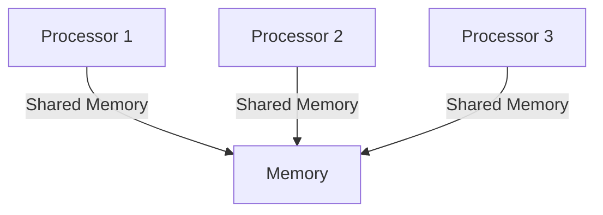
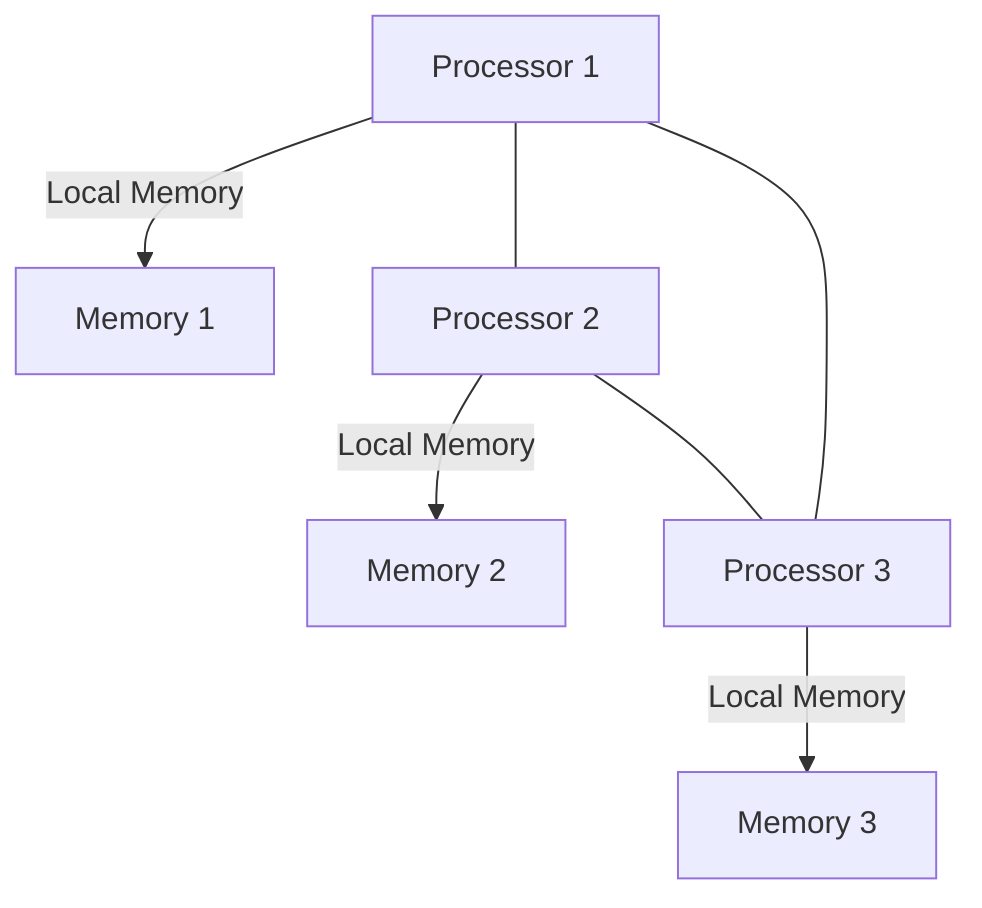
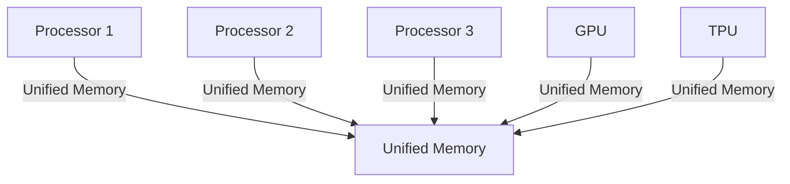
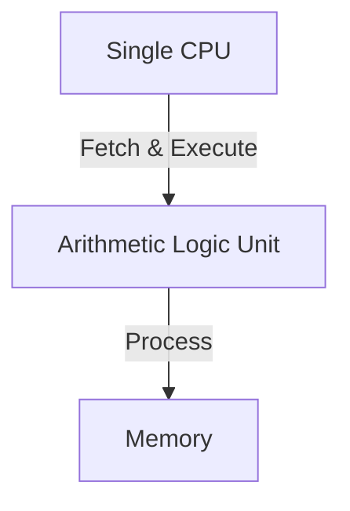
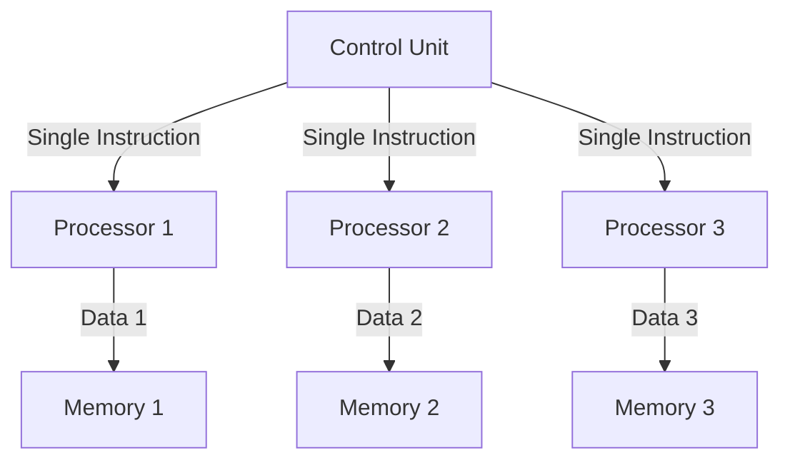
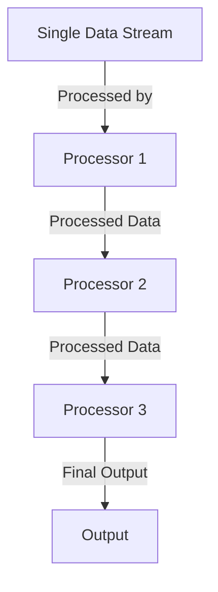
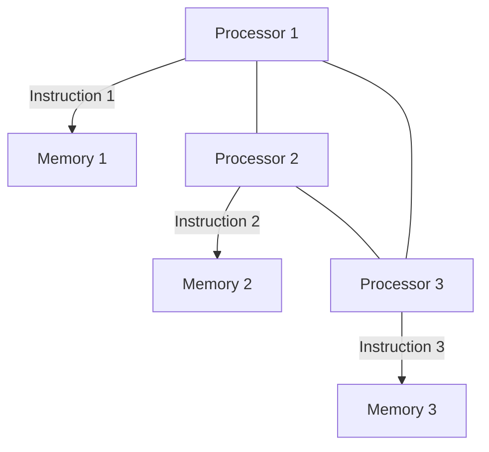

# Advances in Architecture

> A multiprocessor system consists of two or more processors that can cooperate and communicate with each other to solve larger problems faster using one or more memory modules. It also includes an interconnection network that links the processors to each other and to the memory modules.

## Types of Multiprocessor Architectures

Multiprocessor systems can be broadly classified into two categories: **Shared Memory Architecture** and **Distributed Memory Architecture**.

| Feature                | Shared Memory Architecture                      | Distributed Memory Architecture              |
| ---------------------- | ----------------------------------------------- | -------------------------------------------- |
| Address Space          | Uses the same virtual address space             | Each processor has a different address space |
| Memory Access          | Any processor can directly access shared memory | Processors communicate via message passing   |
| Scalability            | Limited due to memory contention                | More scalable, no single memory bottleneck   |
| Communication Overhead | Low, as memory is shared                        | High, as explicit messaging is needed        |

## Multiprocessor Architecture Diagrams

### Shared Memory Architecture

### Distributed Memory Architecture

### Unified Memory Architecture

---

## Memory Access

| Uniform UMA                                                      | Non-Uniform NUMA                                   |
| ---------------------------------------------------------------- | -------------------------------------------------- |
| All memory is allocated at the same distance from all processors | A portion of memory is allocated to each processor |
| Physically centralized memory                                    | Physically distributed memory                      |
| Accessing memory is slower                                       | Accessing local-memory is faster                   |
|                                                                  |                                                    |

---

# Flynn's Classical Taxonomy

> Classifies computer architecture based on the number of instructions that can be executed and how they operate on data

## 1. **Single Instruction Single Data (SISD)**

### **2. Single Instruction Multiple Data (SIMD)**

### **3. Multiple Instruction Single Data (MISD)**

### **4. Multiple Instruction Multiple Data (MIMD)**

---

# Parallel Computers

- Multiple hardware execution cores
- Multiple hardware threads

---

# Walls

## Memory wall

> Processor clock rates have been increasing faster than memory clock rates. Larger and faster cache help reduce the problem but does not. If memory latency and bandwidth become insufficient to provide processors with enough instructions and data. To continue computations, processors will be stalled for a long time, waiting for memory. If more cores are placed on the chip, it increases memory processor performance gap.

## Power Wall

Scaling to historical levels because of the fundamental constraints imposed by power delivery and power dissipation. Processors consume more power as they become faster.

## ILP Wall

Deeper pipelines make the power problem worse.

---

# Ways of increasing speed

## 1. Work harder

Increase the clock speed. (HW solution) Piezo electric. Overcome the power-wall

## 2. Work smarter

Use optimized cache.

## 3. Work with help

Use many processors.

---

## Core

A core is a unit that reads and executes instructions. Each core does what the [[OS]] tells it todo. In one core, several threads can be run.

## Threads

Sequences of commands given to the cores.

---
