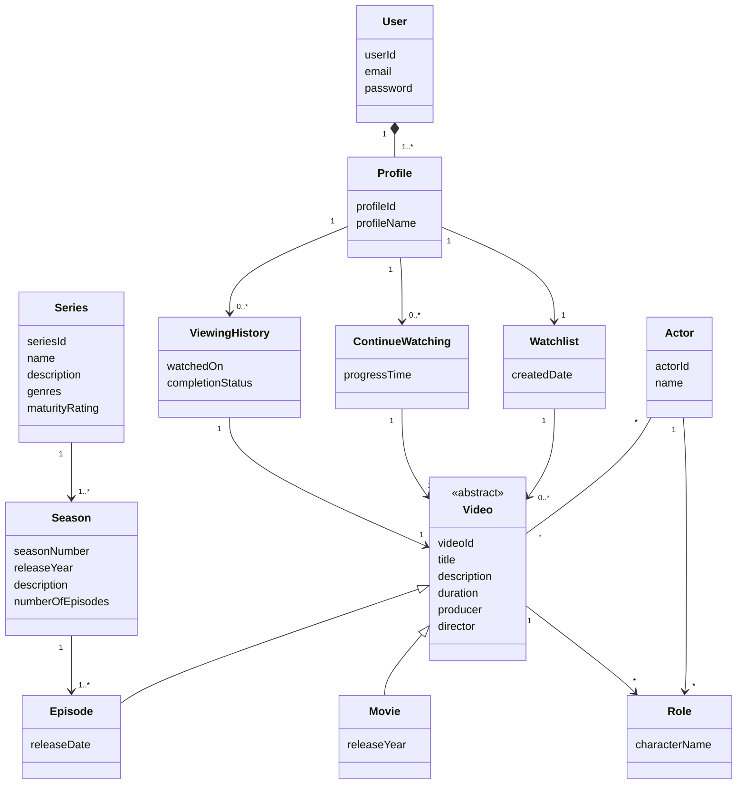

#  OOAD: Class Assignment

> Submission Date: 2026-01-15
> Name: **Nathan Matthew Paul**
> SRN: **PES2UG23CS368**
> Section: 6F

## Class Diagram for OTT APP

```mermaid
classDiagram

class Video {
  <<abstract>>
  videoId
  title
  description
  duration
  producer
  director
}

class Movie {
  releaseYear
}

class Episode {
  releaseDate
}

Video <|-- Movie
Video <|-- Episode

class Series {
  seriesId
  name
  description
  genres
  maturityRating
}

class Season {
  seasonNumber
  releaseYear
  description
  numberOfEpisodes
}

Series "1" --> "1..*" Season
Season "1" --> "1..*" Episode

class Actor {
  actorId
  name
}

class Role {
  characterName
}

Actor "*" -- "*" Video
Actor "1" --> "*" Role
Video "1" --> "*" Role

class User {
  userId
  email
  password
}

class Profile {
  profileId
  profileName
}

User "1" *-- "1..*" Profile

class Watchlist {
  createdDate
}

Profile "1" --> "1" Watchlist
Watchlist "1" --> "0..*" Video

class ContinueWatching {
  progressTime
}

Profile "1" --> "0..*" ContinueWatching
ContinueWatching "1" --> "1" Video

class ViewingHistory {
  watchedOn
  completionStatus
}

Profile "1" --> "0..*" ViewingHistory
ViewingHistory "1" --> "1" Video

```
